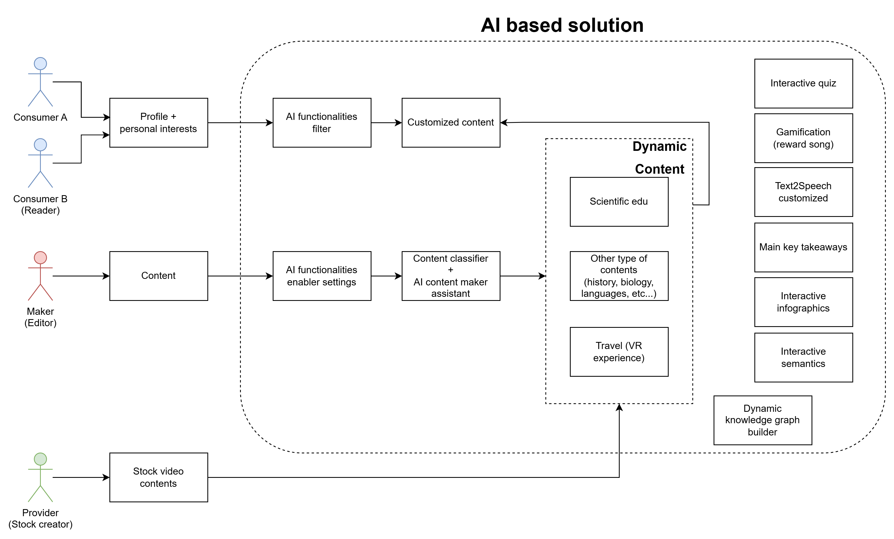

# FluidContent AI 🌊

**Be water, my content.**

## 🚀 About The Project

FluidContent AI is an innovative solution designed to revolutionize digital content consumption. In a world saturated with information, capturing and retaining user attention is paramount. Traditional static content is losing its power. FluidContent AI addresses this challenge by transforming standard digital articles, news, and information into dynamic, personalized, and interactive experiences.

Leveraging the power of Artificial Intelligence, FluidContent AI adapts content in real-time to individual user profiles – considering their age, interests, and preferences – making every piece of content uniquely engaging. It's not just about reading; it's about experiencing content that flows and resonates with each user.

**Our Mission:** To redefine digital content engagement by making it more adaptive, interactive, and valuable for both users and publishers.

### ✨ Core Features

*   **Dynamic Text Adaptation:** Modifies tone, style, complexity, and length of content to perfectly match the user's profile (age, interests, preferences).
*   **Key Takeaways Extraction:** Automatically identifies and lists 3-5 main points from the adapted content for quick understanding.
*   **Interactive Quizzes:** Generates 2-3 engaging questions based on the adapted content to enhance learning and interaction.
*   **Gamified Engagement System:**
    *   **Points & Badges:** Users earn points and unlock badges for reading, completing quizzes, participating in challenges, and consistent engagement.
    *   **Monthly Leaderboards:** Tracks user activity and ranks top performers on a monthly basis.
    *   **Exclusive Rewards:** Top 3 users on the monthly leaderboard receive a unique, curated song as a reward, fostering a fun and competitive community.
*   **Optimized Titles:** Suggests more captivating titles tailored to the user.
*   **Sentiment Analysis:** Provides a quick sentiment overview of the adapted text.

### Built With
*   **Frontend:** React, Vite
*   **Backend:** Python, FastAPI
*   **AI Core:** Google Gemini
*   **Database:** SQLite
*   **Deployment:** Netlify, Docker

---

## 🎯 The Challenge Addressed

Digital publishing faces urgent challenges:
1.  **Declining Attention:** Static formats struggle to retain user focus.
2.  **Limited Interaction:** Passive reading leads to superficial engagement.
3.  **Rigid Content:** A need for dynamic, AI-driven personalization.
4.  **The AI Opportunity:** How can AI reshape publishers' roles and create truly immersive experiences?

FluidContent AI is our answer to these challenges, aiming to create a future where content is a living, breathing entity.

---

## 💡 Solution Overview

FluidContent AI processes original content alongside user profile data. An advanced AI assistant then performs several transformations:

1.  **Adapts the text** to be fluid and resonant.
2.  **Extracts key insights.**
3.  **Generates an interactive quiz.**
4.  Optionally suggests a new title and analyzes sentiment.

The output is a structured JSON for seamless integration into any digital platform, providing a richer, more engaging experience for the user and enhanced value for publishers and brands.



---

## 🚀 Running the Application
### 💻 Local deploy

How to locally run the application.

**Prerequisites:**

*   Node.js v18+ (or your specified version) installed (for frontend)
*   Python v3.9+ (or your specified version) installed (for backend)
*   `pip` and `venv` (usually comes with Python)
*   Gemini API Key
*   ElevenLabs API Key
*   Git

**Installation & Setup:**

1.  **Clone the repository:**
    ```sh
    git clone https://github.com/Gabbosaur/FluidContent-AI.git
    cd FluidContent-AI
    ```

2.  **Set up and run the Backend (Python):**
    *   Navigate to the backend directory:
        ```sh
        cd backend
        ```
    *   Create a virtual environment:
        ```sh
        python -m venv venv 
        # Or: python3 -m venv venv
        ```
    *   Activate the virtual environment:
        *   On Windows:
            ```sh
            .\venv\Scripts\activate
            ```
        *   On macOS/Linux:
            ```sh
            source venv/bin/activate
            ```
        *(You should see `(venv)` at the beginning of your terminal prompt)*
    *   Install backend dependencies:
        ```sh
        pip install -r requirements.txt
        ```
    *   Set up environment variables:
        Create a `.env` file and add your variables:
        ```
        GEMINI_API_KEY=your_gemini_api_key_here
        ELABS_API_KEY=your_elevenlabs_api_key_here
        ```
    *   Run the backend server:
        ```sh
        uvicorn main:app
        # Default port is usually 8000 for uvicorn
        ```

3.  **Set up and run the Frontend (Node.js):**
    *   Navigate to the frontend directory (from the project root, if you were in `backend`):
        ```sh
        cd ../web-ui 
        ```
    *   Install frontend dependencies:
        ```sh
        npm install
        ```
    *   Set up environment variables
        ```
        VITE_API_URL=http://localhost:8000
        ```
    *   Run the frontend development server:
        ```sh
        npm run dev
        ```

4.  **Check the Application:**
    Open your UI URL in your browser (e.g., [http://localhost:8080](http://localhost:8080) or the port specified by `npm run dev`).

### 🐳 Docker Deploy
How to run the application using Docker (recommended for easy setup).

**Prerequisites:**

- Docker
- Docker Compose
- Docker Dekstop (solo per Windows)

**Installation & Setup:**

1.  **Clone the repository:**
    ```sh
    git clone https://github.com/Gabbosaur/FluidContent-AI.git
    cd FluidContent-AI
    ```
2.  **Install and launch the application:**
    ```sh
    docker compose up --build
    ```
3.  **Check the Application:**
    Open your UI URL in your browser (e.g., [http://localhost:8080](http://localhost:8080)).

---

## 🌐 Live Demo

Try it yourself: [fluid-content-ai.netlify.app](https://fluid-content-ai.netlify.app/)

You can create a new user or log in with one of the predefined test accounts:

- **chen@ai.com** / **TEST**
- **gabbo@ai.com** / **TEST**
- **mondadori@ai.com** / **TEST**

**⚙️ Tech behind the scenes:**

- **Frontend**: hosted on **Netlify** (free tier)
- **Backend**: hosted on **Render** (free tier)

So yes, it's magic, but also **free-tier magic**.  
That means you *might* notice occasional delays, autosleep mode naps 😴, or limits on data transfer 🚧.  
Oh, and our servers are based in Europe, so depending on where you are, your data may be going on a little Eurotrip. ✈️🇪🇺

---

## 👥 Authors / Team FluidContent AI

*   **Gabriele Guo** ([@Gabbosaur](https://github.com/Gabbosaur)) - *AI enthusiast, Software Designer*
*   **Chenghao Xia** ([@Izanagi95](https://github.com/Izanagi95)) - *Cloud enthusiast, Full Stack Developer*

---

## 🙏 Acknowledgements & References

A small corner for thanks and the inspirations that contributed to the realization of FluidContent AI.

*   **Inspirational Quote:**
    *   Bruce Lee, for his philosophy <a href="https://www.youtube.com/watch?v=cJMwBwFj5nQ&pp=ygUSYmUgd2F0ZXIgbXkgZnJpZW5k" target="_blank">*"Be water, my friend."*</a> which inspired the name and adaptive approach of our project.<br>
    <a href="https://www.youtube.com/watch?v=cJMwBwFj5nQ&pp=ygUSYmUgd2F0ZXIgbXkgZnJpZW5k" target="_blank"></a>

*   **Hackathon Organizers & Mentors:**
    *   A special thank you to **Codemotion** for organizing this stimulating hackathon, and to **PLAI** for promoting this event.
    *   We are also grateful to our mentors, **Serena** and **Davide**, for their invaluable support and advice throughout the hackathon.
